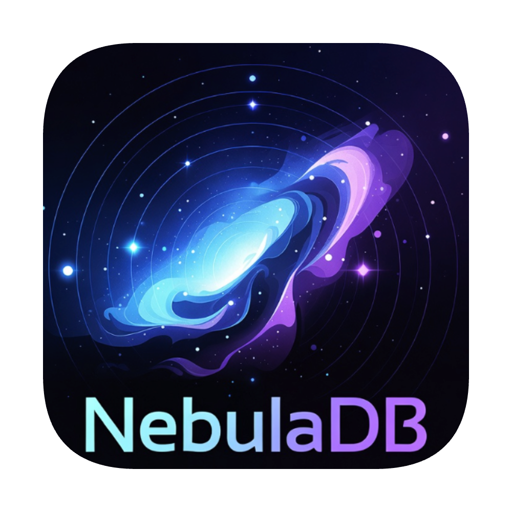

<div align="center">

# NebulaDB



<!--  -->

**A Completely Free and Open Source, Modern, High-Performance Database Management Tool**

[](LICENSE)
[](https://github.com/tauri-apps/tauri)
[](https://tauri.app/)
[](https://reactjs.org/)

[English](README.md) | [简体中文](README_CN.md)

</div>

---

## ✨ Features

### 🆓 **Completely Free & Open Source**
- **100% Free** - No paid features, no subscription fees
- **Open Source** - MIT License, transparent code, community-driven
- **No Limitations** - Full access to all features for everyone

### 🎨 **Modern Interface**
- **VS Code-inspired Design** - Familiar, professional interface with glassmorphism effects
- **Dark/Light Theme** - Eye-friendly themes with smooth transitions
- **Responsive Layout** - Resizable panels for optimal workspace organization
- **Minimalist Aesthetic** - Clean, distraction-free environment

### 🗄️ **Multi-Database Support**
- **PostgreSQL** - Full support for PostgreSQL databases
- **MySQL** - Complete MySQL/MariaDB compatibility
- **SQLite** - Lightweight embedded database support
- **Redis** - Key-value store management (in development)

### 🚀 **Powerful Features**
- **AI-Powered SQL Generation** - Generate SQL queries using natural language (powered by Gemini)
- **Visual Table Designer** - Create and modify tables with an intuitive GUI
- **SSH Tunnel Support** - Securely connect to remote databases
- **SSL/TLS Encryption** - Secure database connections
- **SQL Editor** - Monaco editor with syntax highlighting and auto-completion
- **Query History** - Track and reuse previous queries
- **Data Export** - Export data in JSON, CSV formats
- **Multi-Language** - English and Chinese interface support

### 🔧 **Developer Tools**
- **SQL Formatter** - Beautify your SQL code automatically
- **Result Table** - Interactive data grid with sorting and filtering
- **Connection Management** - Save and manage multiple database connections
- **Real-time Console** - Monitor queries and system logs

---

## 📦 Installation

### Prerequisites
- **Node.js** 16+ 
- **Rust** 1.77.2+ (for building from source)
- **Gemini API Key** (for AI features)

### Quick Start

1. **Clone the repository**
   ```bash
   git clone https://github.com/yourusername/nebuladb.git
   cd nebuladb
   ```

2. **Install dependencies**
   ```bash
   npm install
   ```

3. **Set up environment**
   - Create a `.env.local` file in the root directory
   - Add your Gemini API key:
     ```
     GEMINI_API_KEY=your_api_key_here
     ```

4. **Run in development mode**
   ```bash
   npm run tauri dev
   ```

5. **Build for production**
   ```bash
   npm run tauri build
   ```

---

## 🎯 Usage

### Creating a Connection

1. Click the **+** button in the sidebar
2. Select your database type (PostgreSQL, MySQL, SQLite)
3. Fill in connection details:
   - Host and Port
   - Username and Password
   - Database name
4. (Optional) Configure SSH tunnel or SSL/TLS
5. Click **Test Connection** to verify
6. Click **Save & Connect**

### Using the AI Assistant

1. Select a database and table
2. Click the **AI Assist** button or press `Ctrl+Shift+A`
3. Describe your query in natural language:
   - *"Find all users who registered last week"*
   - *"Get the top 10 products by sales"*
   - *"Show me active orders with customer details"*
4. Review and execute the generated SQL

### Designing Tables

1. Right-click on a database in the sidebar
2. Select **Create Table** or **Design Table**
3. Use the visual designer to:
   - Add/modify columns
   - Set data types and constraints
   - Create indexes
   - Define foreign keys
4. Preview the generated SQL
5. Click **Save** to create/modify the table

---

## 🛠️ Tech Stack

### Frontend
- **React 19.2** - UI framework
- **TypeScript** - Type-safe development
- **Monaco Editor** - Code editor component
- **Tailwind CSS** - Utility-first styling
- **Lucide React** - Beautiful icons
- **i18next** - Internationalization

### Backend
- **Tauri 2.9** - Desktop application framework
- **Rust** - High-performance backend
- **SQLx** - Async SQL toolkit
- **Tokio** - Async runtime

### AI Integration
- **Google Gemini API** - Natural language to SQL generation

---

## 🗺️ Roadmap

- [ ] MongoDB support
- [ ] Query builder GUI
- [ ] Database diagram visualization
- [ ] SQL migration tools
- [ ] Multi-tab query editor
- [ ] Custom themes and color schemes
- [ ] Query performance analyzer
- [ ] Backup and restore tools

---

## 🤝 Contributing

Contributions are welcome! Please feel free to submit a Pull Request.

1. Fork the repository
2. Create your feature branch (`git checkout -b feature/AmazingFeature`)
3. Commit your changes (`git commit -m 'Add some AmazingFeature'`)
4. Push to the branch (`git push origin feature/AmazingFeature`)
5. Open a Pull Request

---

## 📄 License

This project is licensed under the MIT License - see the [LICENSE](LICENSE) file for details.

---

## 🙏 Acknowledgments

- [Tauri](https://tauri.app/) - For the amazing desktop framework
- [Monaco Editor](https://microsoft.github.io/monaco-editor/) - For the powerful code editor
- [Google Gemini](https://deepmind.google/technologies/gemini/) - For AI-powered features
- [Lucide](https://lucide.dev/) - For beautiful icons

---

<div align="center">

**Made with ❤️ by the NebulaDB Team**

[Report Bug](https://github.com/yourusername/nebuladb/issues) · [Request Feature](https://github.com/yourusername/nebuladb/issues)

</div>
